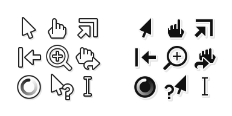

Mocu
====

A modest xcursor theme, inspired by [DMZ] and [cz-Viator].

Available in white and black. Right and left-handed.
Size 24, 36, 48, 60, 72, 96. Distributed under the [CC0].

[DMZ]: https://www.gnome-look.org/p/999970/
[cz-Viator]: https://github.com/charakterziffer/cursor-toolbox/
[CC0]: https://creativecommons.org/publicdomain/zero/1.0

Make
----

The themes can be generated with the make script:

	./make.sh

Dependencies:

- Common bash, sed, grep, etc.
- rsvg-convert
- xmlstarlet
- xcursorgen

Customization
-------------

The theme settings are stored in `src/themes.txt`.

### Colors

The svg files use placeholder colors, which are replaced
with the specific theme colors before rendering.

	#0a0b0c = shadow
	#1a1b1c = stroke
	#fafbfc = fill

### Hotspot

Each svg source file must contain a `<circle>` element with `id="hot"`.
The center of the circle represents the hotspot.

### Handedness

For a given handedness, each occurence of `class="HAND(SCALE,MOVE)"` is
replaced with `transform="translate(MOVE)scale(SCALE,1)"` before rendering.

### Animations

To animate a cursor, the svg source file can be accompanied
by a `.txt` file. Each line in that file represents a frame,
in the format `DELAY ATTRIBUTE`. Each occurence of `class="anim"`
is replaced with `ATTRIBUTE` before rendering the respective frame.
